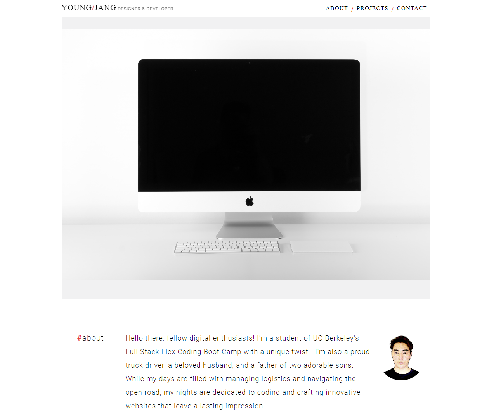

# Portfolio of Young Jang

This application displays my portfolio. It is a single page application that makes use of HTML, CSS, and JavaScript. It is a responsive application that is optimized for different screen sizes.

## Description

It displays my name, a recent photo or avatar, and links to sections about me, my work, and how to contact me. It also has links to the projects I have completed or am currently working on. The application is deployed to GitHub Pages. The application is responsive to different screen sizes: desktop, tablet, and mobile.

## Getting Started

You can access the application by clicking on the link below.

https://jyoungjoon.github.io/youngs-portfolio

### Dependencies

A web browser is required to access the application.

## Authors

Young Jang
[Github](https://github.com/jyoungjoon)

Hero, Footer, and "Coming Soon" Images from [Unsplash](https://unsplash.com/)

## Version History

* 0.1
    * Initial Release

## License

This project is licensed under the MIT License - see the LICENSE.md file for details

## Acknowledgments

Inspiration, code snippets, etc.
* [awesome-readme](https://github.com/matiassingers/awesome-readme)
* [PurpleBooth](https://gist.github.com/PurpleBooth/109311bb0361f32d87a2)
* [dbader](https://github.com/dbader/readme-template)
* [zenorocha](https://gist.github.com/zenorocha/4526327)
* [fvcproductions](https://gist.github.com/fvcproductions/1bfc2d4aecb01a834b46)